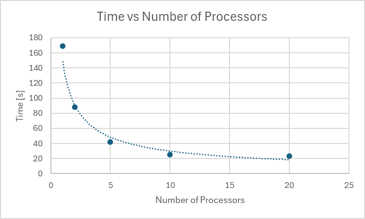

# System Programming Lab 11 Multiprocessing

## Mandel
The program forks the parent process into child processes, each creating one image. When the child process is finished, it exits and the parent creates a new process for a new image. This process repeats until 50 images are created and all processes finish. The maximum number of child processes is specified using the argument `-n %d`

Ex: `$ ./mandel -n 12`

#### Compile
Use the included Makefile: `$ make`

## Results
 

Time vs the number of processors results in an exponential curve showing a large difference between 1 and 2 processors, but a small difference between 10 and 20 processors. This is likely due to the laptop having only 12 logical processors.